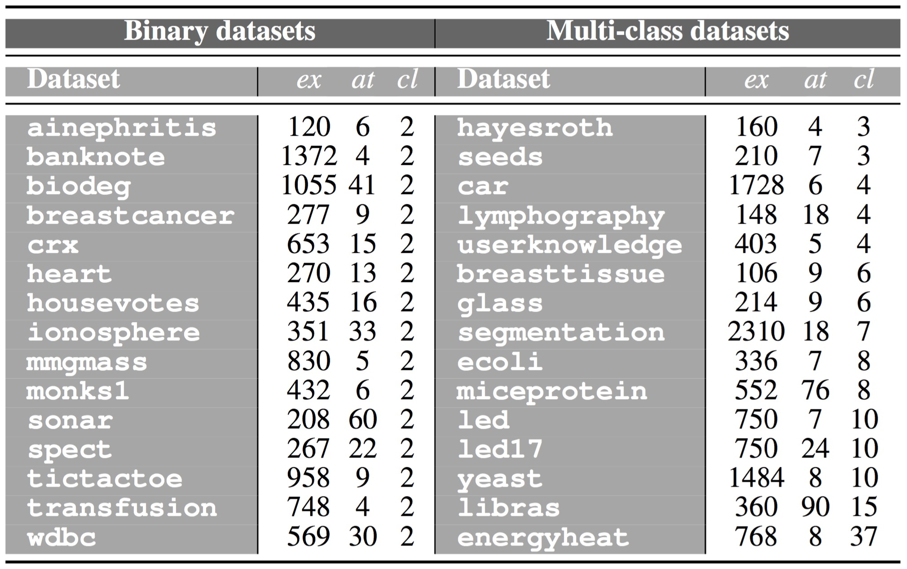
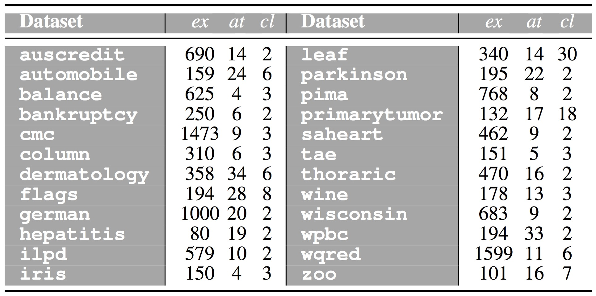
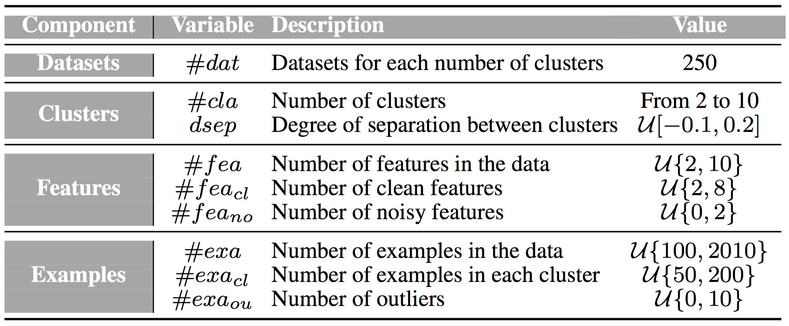

 

This web-page contains complementary material to the research paper:

| | |
|:---|:---|
||José A. Sáez, Emilio Corchado. **A meta-learning recommendation system for characterizing unsupervised problems: on using quality indices to describe data conformations**. [IEEE Access](https://ieeeaccess.ieee.org/), vol. 7, pp. 63247-63263, 2019.|
| | |

 

The web is organized according to the following summary:

1. [Abstract](#Abstract)
2. [Datasets](#Datasets)
3. [Performance results](#Performance)

 
 
##  1. Abstract
The clustering of a new *unsupervised problem* usually requires of knowing both if the samples may be separable in different groups and the number of these groups. This information, which has a great impact in the results obtained, is generally unknown beforehand. A wide explored research line in the literature proposes to use some metrics, known as *quality indices*, to determine the number of clusters in a dataset. However, they may lead to variable results depending on the metric chosen. This research analyzes the usage of a novel meta-learning system for determining the number of clusters in unsupervised data, called *Meta-Learning Recommendation System for Cluster Cardinality Estimation* (MLRS-CCE). It is based on the idea of using quality metrics not as a solution to the problem, but as a means to characterize the inner structure of each dataset and employing this information to detect when unsupervised data is not uniform and suggest additional information about the amount of clusters in the data. In order to achieve such goals a large collection of both real-world and synthetic datasets, in which the number of clusters is known *a priori*, are used to build the system and check its performance. The meta-learning system was successfully tested on such data, showing that it is accurate enough, both separating uniform data from non-uniform one and predicting cluster cardinality when it is compared to the results given by individual quality indices.

 
 
##  2. Datasets

 

### 2.1. Real-world datasets

30 real-world classification datasets are used as a basis to build the meta-learning recommendation system and another 24 are considered to validate its usefulness when characterizing unsupervised problems. In this way, different data structures from those of the datasets used in the building phase of the models are considered when validating the system. The following tables shows these datasets, along with their number of examples (*ex*), attributes (*at*) and classes (*cl*).

|||
|:---:|:---:|
|**Training datasets**|**Validation datasets**|
|||
|||

These datasets can be downloaded from the web-page of the [UCI Machine Learning Repository](https://archive.ics.uci.edu/ml/index.php).

 

### 2.2. Synthetic datasets

In the second scenario of study, instead of real-world datasets, synthetic data are used to build the meta-learning system. Thus, synthetic datasets with a different number of clusters (from 2 to 10) are created based on the random cluster generation algorithm proposed by Qiu and Joe (2006), in which the minimum degree of separation between a cluster and its nearest neighbor clusters is set by an user parameter. This proposal uses positive definite covariance matrices corresponding to different shapes, diameters and orientations of the clusters generated. Random noisy features and outliers are also considered when generating the synthetic datasets. The complete details about the cluster data generation method and the source code used to generate the synthetic data over the meta-learning system is built can be downloaded below:

|||
|:---|:---:|
|**Description** |**File**|
|Weiliang Qiu and Harry Joe. **Generation of random clusters with specified degree of separation**. *Journal of Classification*, 23(2):315–334, 2006.| |
|Source code of the random cluster generation method of Qiu and Joe (2006)| |
|||

The parameter setup used with the above source code to genereate the synthetic dataset in this scenario is show in the following table:

 

##  3. Performance results

|||
|:---|:---:|
|**Distributions of quality indices** |**File**|
|&nbsp;&nbsp;&nbsp;**-** *Histograms for real-world datasets* | |
|&nbsp;&nbsp;&nbsp;**-** *Histograms for synthetic datasets* | |
|||
|**Performance results of cluster cardinality estimation methods** |**File**|
|&nbsp;&nbsp;&nbsp;**-** *Performance for real-world datasets* | |
|&nbsp;&nbsp;&nbsp;**-** *Performance for synthetic datasets* | |
|&nbsp;&nbsp;&nbsp;**-** *Performance for data with two cluster cardinalities* | |
|||
